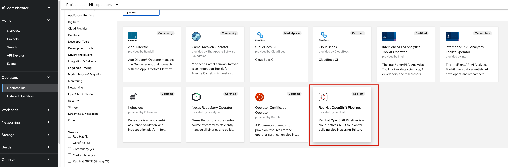
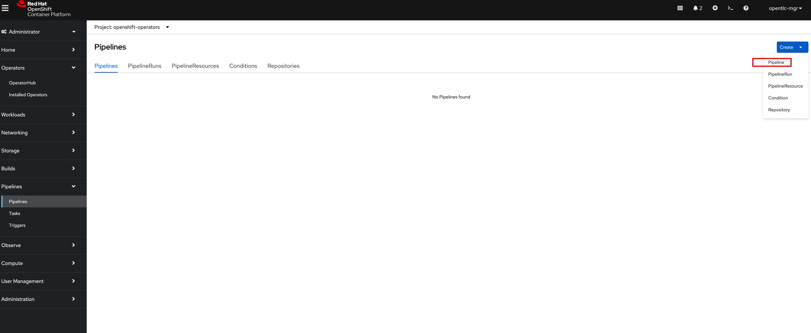
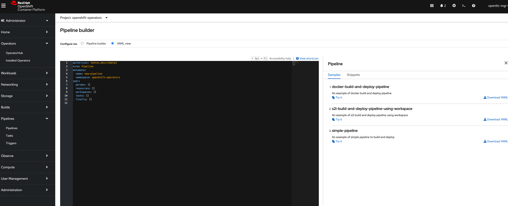
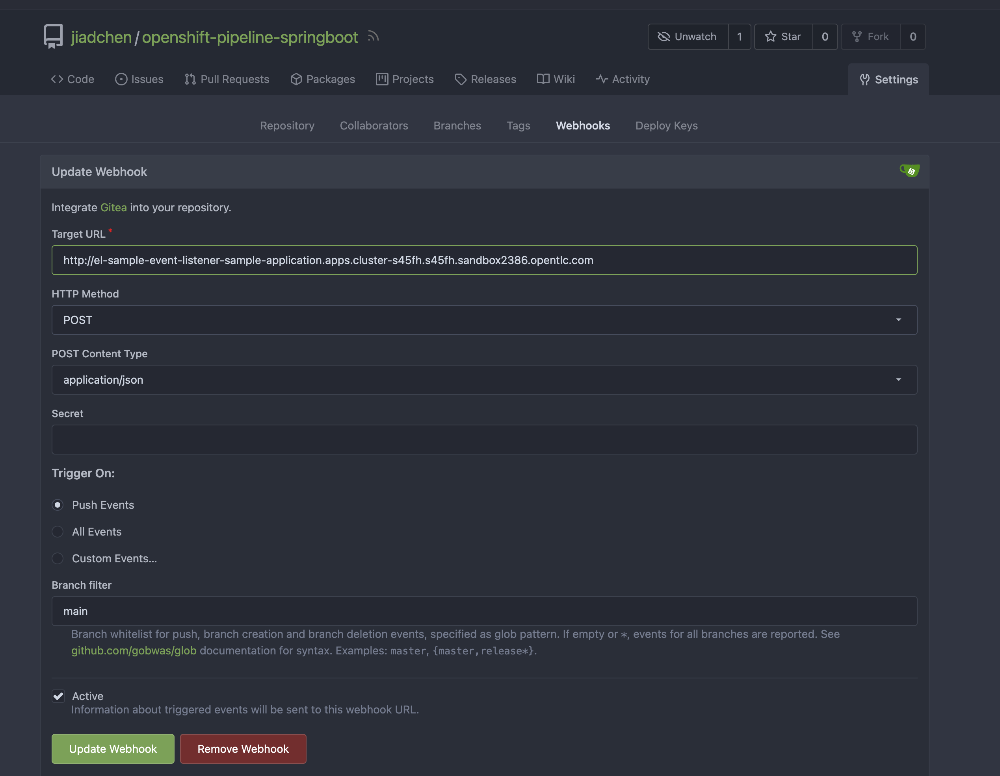
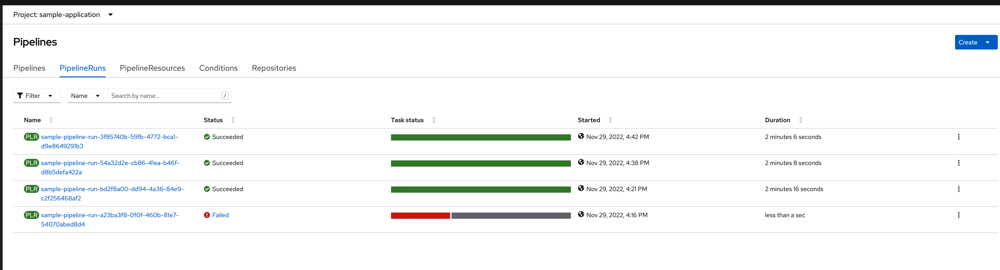

# Operatorのインストール

デフォルト設定でOpenShift Pipelineをインストール


# Pipelineを作成する
`sample-application`というプロジェクトを新規作成する。
```
oc new-project sample-application
```



下記yamlをコピーして作る。

pipeline-s2i-build-and-deploy.yaml

- git-cloneでgit repositoryをcloneする
- s2i-javaで`./applications/api`配下のjava appをdocker imageにしてdockerリポジトリにアップロードする
- deployでアップロードされたdocker imageをpodにdeployする

# PipelineRunを作成する(triggerができたらこれは不要になる)

pipelineRun.yaml

- image nameを定義
- git repository の URLを定義

前と同じようにyamlをコピーして作成

# Trigger関連
## [こちら](https://access.redhat.com/documentation/ja-jp/openshift_container_platform/4.5/html/pipelines/adding-triggers_creating-applications-with-cicd-pipelines)を参考にして、
TriggerBinding、TriggerTemplate、EventListenerを作成する。

修正後のファイル：
- cicd/trigger/trigger-binding.yaml
- cicd/trigger/trigger-template.yaml
- cicd/trigger/event-listener.yaml

## Webhook
Giteaの場合：

Target URLはevent-listenerをserviceとしてexposeしたURLです。

# Pipelineが走る
git pushすると、pipelineが走ります。


# trubleshooting
## 
[ここ](https://access.redhat.com/documentation/ja-jp/openshift_container_platform/4.5/html/pipelines/adding-triggers_creating-applications-with-cicd-pipelines)でEventListenerを作成しようとしたら、`admission webhook "webhook.triggers.tekton.dev" denied the request: mutation failed: cannot decode incoming new object: json: unknown field "name"`エラーが出て、[ここ](https://github.com/tektoncd/triggers/issues/909)に解決策がありました。


