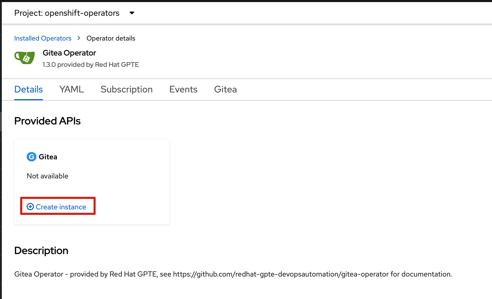
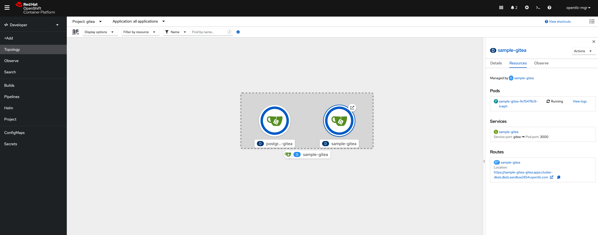

# Opeartorのインストール
https://github.com/redhat-gpte-devopsautomation/gitea-operator

openshift の Web Terminalを使って下記コマンドを打ちます。
`oc apply -f https://raw.githubusercontent.com/redhat-gpte-devopsautomation/gitea-operator/master/catalog_source.yaml`
これでOperator HubでGiteaが現れます。

Gitea Operatorをインストールします。

# Gitea instanceを作成
Gitea用 Projectを作成
```
oc new-project gitea
```

```yaml
apiVersion: gpte.opentlc.com/v1
kind: Gitea
metadata:
  name: simple-gitea
spec:
  giteaImageTag: latest
  giteaSsl: true
  giteaVolumeSize: 4Gi
  postgresqlVolumeSize: 4Gi
```

GiteaのWeb画面にアクセスします。

